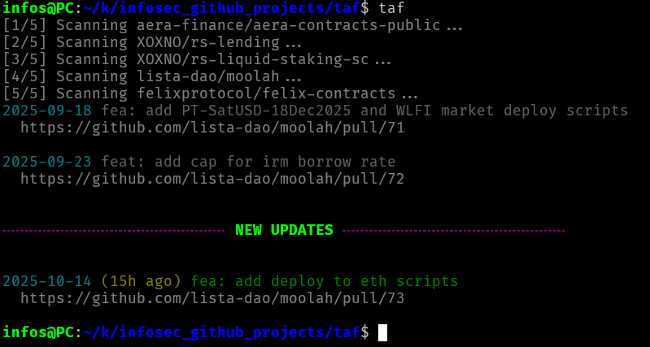

# TAF - Terminal Activity Feed

A simple to use and beautiful terminal-based activity feed for monitoring merged Pull Requests across multiple GitHub repositories. Perfect for bug bounty hunters, security researchers, and developers who need to track changes across Immunefi (or any other) GitHub projects.



## Features

- 🔍 **Multi-Repository Scanning** - Monitor multiple GitHub repositories from a single command
- ✨ **Smart Change Tracking** - Automatically tracks which updates you've already seen
- 🎨 **Beautiful TUI** - Color-coded output with elegant visual separators
- ⏰ **Recent Activity Highlighting** - Shows "hours ago" for today's merges
- 📊 **Progress Indicators** - Real-time scanning progress for multiple repos
- 📅 **30-Day Window** - Focuses on recent activity from the last month

## Installation

1. Add the alias function to your shell alias file (`~/.bash_aliases`, if using bash):

```bash
function taf() {
    # CONFIGURATION: Set this to your TAF directory
    taf_dir="/home/user/.config"
    
    # Derived paths
    immunefi_targets_path="$taf_dir/targets.txt"
    last_seen_file="$taf_dir/.last_seen"

    # Check if targets file exists
    if [ ! -f "$immunefi_targets_path" ]; then
        echo -e "\u001b[31mError: targets.txt not found at $immunefi_targets_path\u001b[0m" >&2
        echo -e "\u001b[33mPlease create a targets.txt file with one GitHub repo per line (format: owner/repo)\u001b[0m" >&2
        return 1
    fi
    
    # Get the timestamp from last run (or use 30 days ago as fallback)
    if [ -f "$last_seen_file" ]; then
        last_seen=$(cat "$last_seen_file")
    else
        last_seen=$(date -u -d '30 days ago' +%Y-%m-%dT%H:%M:%SZ 2>/dev/null || date -u -v-30d +%Y-%m-%dT%H:%M:%SZ)
    fi
    
    # Count total repos
    total=$(wc -l < "$immunefi_targets_path")
    current=0
    
    # Store current timestamp for next run
    current_run=$(date -u +%Y-%m-%dT%H:%M:%SZ)
    
    while read repo; do
        ((current++))
        echo -e "\u001b[90m[$current/$total] Scanning $repo...\u001b[0m" >&2
        gh -R "$repo" pr list -s merged --json 'title,url,mergedAt' --limit 10
        sleep 1
    done < "$immunefi_targets_path" | jq -sr \
        --arg cutoff "$(date -u -d '30 days ago' +%Y-%m-%dT%H:%M:%SZ 2>/dev/null || date -u -v-30d +%Y-%m-%dT%H:%M:%SZ)" \
        --arg last_seen "$last_seen" \
        --arg today "$(date -u +%Y-%m-%d)" \
    'add | map(select(.mergedAt > $cutoff)) | sort_by(.mergedAt) | 
    (map(select(.mergedAt <= $last_seen))) as $old_items |
    (map(select(.mergedAt > $last_seen))) as $new_items |
    (
        ($old_items | .[] |
        (if (.mergedAt[:10] == $today) then 
            ((now - (.mergedAt | fromdateiso8601)) / 3600 | floor | tostring) + "h ago" 
         else 
            "" 
         end) as $hours_ago |
        "\u001b[36m\(.mergedAt[:10])\u001b[0m" + (if $hours_ago != "" then " \u001b[33m(\($hours_ago))\u001b[0m" else "" end) + " \u001b[2m\(.title)\u001b[0m\n  \u001b[90m\(.url)\u001b[0m\n"),
        
        (if ($new_items | length) > 0 and ($old_items | length) > 0 then
            "\n\u001b[35m╌╌╌╌╌╌╌╌╌╌╌╌╌╌╌╌╌╌╌╌╌╌╌╌╌ \u001b[0m\u001b[1;32mNEW UPDATES\u001b[0m\u001b[35m ╌╌╌╌╌╌╌╌╌╌╌╌╌╌╌╌╌╌╌╌╌╌╌╌╌\u001b[0m\n\n"
         else
            ""
         end),
        
        ($new_items | .[] |
        (if (.mergedAt[:10] == $today) then 
            ((now - (.mergedAt | fromdateiso8601)) / 3600 | floor | tostring) + "h ago" 
         else 
            "" 
         end) as $hours_ago |
        "\u001b[36m\(.mergedAt[:10])\u001b[0m" + (if $hours_ago != "" then " \u001b[33m(\($hours_ago))\u001b[0m" else "" end) + " \u001b[32m\(.title)\u001b[0m\n  \u001b[90m\(.url)\u001b[0m\n")
    )'
    
    # Save timestamp for next run
    echo "$current_run" > "$last_seen_file"
}
```

2. Update the `taf_dir` variable on line 3 of the script to point to a directory that contains your `target.txt` file.

```bash
    taf_dir="/home/user/.config"
```

- **Targets file**: should be located at `taf_dir/targets.txt`
- **Last seen tracker**: will be located at `taf_dir/.last_seen`

Then source:

```bash
source ~/.bashrc
```

3. Fill your `targets.txt` file in the configured path with one GitHub repository per line:

```
owner/repo-name
another-owner/another-repo
```

4. Make sure you have the required dependencies:
   - [GitHub CLI](https://cli.github.com/) (`gh`)
   - `jq` for JSON processing

## Usage

Simply run:

```bash
taf
```

The first time you run it, all PRs from the last 30 days will be shown. On subsequent runs, previously seen PRs will appear first (dimmed), followed by a separator, with new PRs highlighted at the bottom for easy viewing—no scrolling required!

## Color Coding

- 🔵 **Cyan** - Dates
- 🟡 **Yellow** - "Hours ago" timestamp for today's merges
- 🟢 **Green** - PR titles (new items in bold)
- ⚪ **Gray** - URLs and dimmed text (previously seen items)
- 🟣 **Magenta** - Separator line with bold green "NEW UPDATES" label

## Use Cases

- **Bug Bounty Hunting** - Stay updated on security fixes in target protocols
- **Security Research** - Monitor patches and vulnerabilities across projects
- **Developer Awareness** - Track changes in dependencies
- **Competitive Analysis** - Watch what competitors are shipping

## License

MIT License - Feel free to modify and distribute as needed.

## Contributing

Contributions are welcome! Feel free to open issues or submit pull requests.

## Tips

- Run `taf` as part of your daily routine to stay on top of changes
- Add it to your morning startup script

---

Made with ❤️ for the security research community
